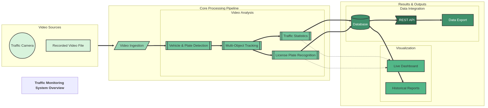

# Traffic Monitoring System: Comprehensive Guide

## System Overview

The Traffic Monitoring System is an intelligent computer vision application that automatically analyzes traffic video footage. It combines modern artificial intelligence techniques with practical traffic monitoring needs to create a powerful yet accessible tool.



### Core Capabilities

This system provides the following capabilities:

- **Vehicle Detection**: Identifies various vehicles (cars, trucks, buses, motorcycles) in video streams using AI
- **Vehicle Tracking**: Follows each vehicle's movement through the entire video, maintaining its identity
- **Traffic Counting**: Counts vehicles crossing a user-defined line with directional information (up/down)
- **License Plate Recognition**: Reads and records license plate text using optical character recognition
- **Data Storage**: Records all observations in a database for future analysis
- **Visualization**: Displays real-time results with visual overlays showing detections, tracks, and counts

## How The System Works

### The Processing Pipeline

The Traffic Monitoring System processes video through a sequence of specialized components:

1. **Video Ingestion** → 2. **Object Detection** → 3. **Object Tracking** → 4. **Vehicle Counting** → 5. **License Plate Reading** → 6. **Data Storage**

Each frame from the video follows this path, with results from each stage feeding into the next. Let's examine each component in detail:

### 1. Video Ingestion Component

This component is responsible for acquiring video frames from various sources:

- **Video Files**: Recorded traffic footage (MP4, AVI, MOV)
- **Live Cameras**: Direct feed from USB cameras or webcams
- **Network Streams**: RTSP streams from IP cameras or other video sources

**Key Features:**
- Frame skipping for performance optimization
- Resolution adjustment for various processing needs
- Frame buffering to ensure smooth processing

This component runs in a separate thread to avoid blocking the main application, allowing continuous frame capture while processing occurs.

### 2. Object Detection Component

This component uses deep learning to locate vehicles and license plates in each video frame:

**Two-Stage Detection Process:**
1. First identifies vehicles in the full frame
2. Then looks for license plates within the vehicle regions

**Technical Implementation:**
- Uses YOLO (You Only Look Once) neural networks converted to ONNX format
- Supports hardware acceleration on compatible devices (CUDA, TensorRT, DirectML)
- Applies filters to focus only on relevant vehicle classes (cars, trucks, buses, etc.)

Each detection includes:
- Bounding box coordinates (where the object is located)
- Confidence score (how certain the AI is about the detection)
- Class ID (what type of object it is)

### 3. Object Tracking Component

This component maintains the identity of each vehicle as it moves through the video:

**Key Functions:**
- Assigns a unique ID to each detected vehicle
- Creates persistent tracks across multiple frames
- Records movement paths for each vehicle
- Handles occlusions (when vehicles are temporarily hidden)

**Technical Implementation:**
- Uses BoxMOT algorithms (ByteTrack by default)
- Employs motion prediction to handle brief disappearances
- Calculates speed estimates based on position changes

The tracking information allows the system to count each vehicle exactly once, even if it appears in many consecutive frames.

### 4. Vehicle Counting Component

This component counts vehicles as they cross a defined line in the video:

**Key Features:**
- Customizable counting line placement
- Directional counting (distinguishes between vehicles going up/down or left/right)
- Per-vehicle-type counting (separates cars, trucks, buses)
- Real-time count statistics

**Implementation Details:**
- Analyzes the path of each tracked vehicle
- Uses vector mathematics to determine line crossing events
- Prevents double-counting by tracking which vehicles have already been counted

The counting line can be defined using either:
- Normalized coordinates (0-1 values, where 0.5 is the center)
- Raw pixel coordinates (exact screen positions)

### 5. License Plate Recognition Component

This component reads text from detected license plates:

**Processing Steps:**
1. Crops the license plate region from the frame
2. Enhances the image (adjusts contrast, removes noise)
3. Applies OCR (Optical Character Recognition) to extract text
4. Cleans and normalizes the text (removes errors, fixes common misreadings)

**Technical Implementation:**
- Uses EasyOCR for text recognition
- Tracks multiple readings of the same plate across frames
- Uses consensus to improve accuracy (compares multiple readings)

The system maintains a history of license plate readings, which improves accuracy by comparing multiple views of the same plate.

### 6. Data Storage Component

This component preserves all collected information for later analysis:

**Data Categories Stored:**
- Vehicle detections (position, size, type)
- Vehicle tracks (movement paths, speeds)
- Counting events (time, direction, vehicle type)
- License plate readings (text, confidence, associated vehicle)

**Technical Implementation:**
- Uses SQLite database (easily upgradable to other database systems)
- Structured tables with relationships between entities
- Support for queries and data export

### 7. Main Application Controller

This component orchestrates the entire system:

**Key Responsibilities:**
- Initializes and manages all services
- Coordinates the processing pipeline
- Provides visualization of results
- Handles user interactions (keyboard commands, configuration)
- Manages resources and performs cleanup

## Using The System

### Basic Usage

To start the system with a video file:
```
python main.py --source /path/to/video.mp4
```

To use your computer's camera:
```
python main.py --source 0
```

To process a video without displaying the UI (for servers or batch processing):
```
python main.py --source /path/to/input.mp4 --render-video --output /path/to/output.mp4
```

### Available Command Options

| Option | Description |
|--------|-------------|
| `--source` | Video source (file path, camera URL, or device number) |
| `--no-ui` | Run without displaying the video window |
| `--record` | Save the output as a video file |
| `--output` | Path where the output video will be saved |
| `--render-video` | Process video without UI (batch mode) |

### Keyboard Controls

While the system is running:
- Press `q` to quit the application
- Press `r` to reset the vehicle counters

## Customization Options

### Counting Line Placement

The traffic counting line can be positioned in two ways:

1. **Using Normalized Coordinates (Recommended)**:
   ```
   COUNTING_LINE_START=0.25,0.6
   COUNTING_LINE_END=0.75,0.6
   ```
   These values represent percentages of the screen (0-1), making them work with any video resolution.

2. **Using Exact Pixel Coordinates**:
   ```
   USE_RAW_COORDINATES=True
   COUNTING_LINE_START=320,360
   COUNTING_LINE_END=960,360
   ```
   These specify exact pixel positions, which may require adjustment for different videos.

### Detection Sensitivity

Adjust how sensitive the system is to detecting vehicles:

```
DETECTION_CONFIDENCE=0.25  # Lower values detect more vehicles but may increase false positives
```

Values range from 0.1 (very sensitive) to 0.9 (only very clear detections).

### Performance Optimization

If the system runs slowly on your computer, you can improve performance by:

1. **Skipping frames**:
   ```
   FRAME_SKIP=2  # Process every second frame
   ```

2. **Reducing processing resolution**:
   ```
   PROCESS_RESOLUTION=320,240  # Lower resolution for faster processing
   ```

3. **Adjusting detection threshold**:
   ```
   DETECTION_CONFIDENCE=0.4  # Higher threshold means fewer detections to process
   ```

4. **Enabling hardware acceleration** if available:
   ```
   # For NVIDIA GPUs:
   HARDWARE_PROVIDER=cuda
   
   # For Intel hardware:
   HARDWARE_PROVIDER=openvino
   ```

## Hardware Acceleration

The system supports various hardware acceleration options to improve performance:

| Hardware | Acceleration Option | Configuration Setting |
|----------|---------------------|------------------------|
| NVIDIA GPUs | CUDA / TensorRT | `HARDWARE_PROVIDER=cuda` or `tensorrt` |
| AMD GPUs | ROCm | `HARDWARE_PROVIDER=rocm` |
| Intel GPUs/CPUs | OpenVINO | `HARDWARE_PROVIDER=openvino` |
| Windows PCs | DirectML | `HARDWARE_PROVIDER=directml` |
| ARM devices | ARM NN | `HARDWARE_PROVIDER=armnn` |

The system will attempt to automatically select the best option for your hardware.

## Technical Architecture

The system is built using a modular, service-oriented architecture:

```
┌─────────────────┐      ┌─────────────────┐      ┌─────────────────┐
│  Video Sources  │      │  Core Pipeline  │      │     Outputs     │
├─────────────────┤      ├─────────────────┤      ├─────────────────┤
│ - Video Files   │ ──▶  │ - Video Service │ ──▶  │ - Visualization │
│ - Cameras       │      │ - Detection     │      │ - Database      │
│ - RTSP Streams  │      │ - Tracking      │      │ - API Access    │
└─────────────────┘      │ - Counting      │      └─────────────────┘
                         │ - OCR           │
                         └─────────────────┘
```

Each service operates independently but communicates with others through a standardized interface. This design allows for easy:
- Replacement of individual components
- Extension with new features
- Distribution across multiple devices if needed

## Common Use Cases

### Traffic Analysis
- Count vehicles at different times of day
- Analyze traffic patterns over time
- Compare directional flow of traffic

### Security Monitoring
- Record all vehicles entering a property
- Maintain logs of license plates for security purposes
- Set up automated alerts for specific plates

### Research Projects
- Collect data for traffic management studies
- Test computer vision algorithms on real-world data
- Develop new traffic monitoring approaches

### Educational Applications
- Learn about computer vision and AI
- Study traffic engineering principles
- Build data science projects with collected traffic data

## Future Extensions

The modular design makes it easy to extend the system with new capabilities such as:

- **Vehicle Classification**: Distinguish between more vehicle types (sedans, SUVs, motorcycles)
- **Speed Estimation**: Calculate vehicle speeds with proper calibration
- **Incident Detection**: Identify traffic incidents or violations
- **Multi-Camera Support**: Correlate observations across multiple cameras
- **Cloud Integration**: Send data to cloud services for advanced analytics

## Troubleshooting Tips

### System Running Slowly
- Increase frame skipping
- Reduce processing resolution
- Use hardware acceleration if available
- Disable OCR if license plate reading isn't needed

### Poor Detection Quality
- Adjust camera position for better viewing angle
- Ensure adequate lighting
- Lower detection confidence threshold
- Try a different detection model

### License Plate Reading Issues
- Improve video resolution
- Adjust camera to capture plates more clearly
- Add additional OCR languages if plates are from different regions

## Conclusion

The Traffic Monitoring System combines powerful computer vision technology with an accessible interface to provide comprehensive traffic analysis capabilities. By processing video feeds in real-time, it extracts valuable information about vehicle movements, counts, and identities that can be used for a wide range of applications.

Whether you're managing traffic flow, enhancing security, or conducting research, this system provides the tools you need to understand and analyze vehicular activity in any environment.