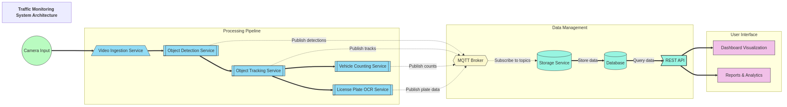

# Traffic Monitoring System Documentation

## 1. Introduction

The Traffic Monitoring System is a modular, scalable solution designed for edge device deployment. It provides real-time detection, tracking, counting, and license plate recognition for vehicles in video streams. This document provides a comprehensive overview of the system architecture, components, and implementation details.

## 2. System Architecture

### 2.1 Overview

The system follows a microservices-inspired architecture, with loosely coupled components that communicate via message passing. This design improves maintainability, allows independent scaling of components, and facilitates component replacement without affecting the entire system.



### 2.2 Key Components

1. **Main Application** (`main.py`): Orchestrates all services and provides visualization
2. **Video Ingestion Service**: Captures and preprocesses video frames
3. **Detection Service**: ONNX-based object detection for vehicles and license plates
4. **Tracking Service**: Multi-object tracking using BoxMOT algorithms
5. **Counting Service**: Counts vehicles crossing a virtual line
6. **OCR Service**: Recognizes license plate text using EasyOCR
7. **Storage Service**: Persists detection results and statistics to a database

### 2.3 Data Flow

1. Video frames are captured by the Video Ingestion Service
2. Frames are processed by the Detection Service to identify vehicles and plates
3. Vehicle detections are tracked across frames by the Tracking Service
4. Crossing events are detected and counted by the Counting Service
5. License plates are read by the OCR Service
6. All data is stored by the Storage Service

### 2.4 Communication

Services communicate using:

1. **Direct method calls**: For real-time processing pipeline
2. **MQTT messaging**: For loosely coupled communication and potential distributed deployment
3. **Database**: For persistent storage and asynchronous access

## 3. Detailed Component Documentation

### 3.1 Video Ingestion Service

**Purpose**: Capture video frames from various sources and make them available for processing.

**Key Features**:
- Support for video files, RTSP streams, and camera devices
- Frame skipping for performance optimization
- Thread-based capture to prevent blocking the main application
- Frame queue to decouple capture from processing
- Resolution adjustment for different processing needs

**Configuration Parameters**:
- `VIDEO_SOURCE`: Path to video file, RTSP URL, or device ID
- `FRAME_SKIP`: Number of frames to skip between processing
- `PROCESS_RESOLUTION`: Target resolution for processing

**Usage Example**:
```python
video_service = VideoIngestionService(source="/path/to/video.mp4")
video_service.start()
frame_data = video_service.get_frame()
```

**Modification Guide**:
- To add support for a new video source type, modify the `start()` method
- To implement additional preprocessing, modify the `_capture_frames()` method
- To change queue behavior, adjust the queue parameters in `__init__`

### 3.2 Detection Service

**Purpose**: Detect vehicles and license plates in video frames using ONNX models.

**Key Features**:
- ONNX runtime for optimized inference on various hardware
- Support for multiple YOLO model versions (YOLOv5, YOLOv8, YOLO11)
- Two-stage detection: vehicles first, then license plates
- Non-maximum suppression for duplicate removal
- Configurable confidence and IoU thresholds

**Configuration Parameters**:
- `VEHICLE_DETECTION_MODEL`: Path to vehicle detection ONNX model
- `PLATE_DETECTION_MODEL`: Path to license plate detection ONNX model
- `VEHICLE_MODEL_VERSION`: Version of the vehicle detection model (yolov5, yolov8, yolo11)
- `PLATE_MODEL_VERSION`: Version of the plate detection model (yolov5, yolov8, yolo11)
- `DETECTION_CONFIDENCE`: Confidence threshold for detections
- `DETECTION_IOU_THRESHOLD`: IoU threshold for non-maximum suppression

**Usage Example**:
```python
detection_service = DetectionService()
detection_results = detection_service.detect(frame_data)
```

**Modification Guide**:
- To use a different model architecture, modify the `ONNXDetector._process_output()` method
- To support a new YOLO version, add a specific processing method (e.g., `_process_yolov9_output()`)
- To add detection of new object types, create additional detector instances
- To optimize performance, adjust preprocessing in `preprocess()` method

### 3.3 Tracking Service

**Purpose**: Track detected vehicles across video frames.

**Key Features**:
- Multiple tracking algorithm support through BoxMOT (ByteTrack, BoTSORT, etc.)
- Trajectory path storage for each tracked object
- Speed estimation based on position changes
- Track management (creation, updating, removal)

**Configuration Parameters**:
- `TRACKER_TYPE`: Type of tracking algorithm to use
- `TRACKING_CONFIDENCE`: Confidence threshold for tracking

**Usage Example**:
```python
tracking_service = TrackingService()
tracking_results = tracking_service.update(frame_data, detection_results)
```

**Modification Guide**:
- To use a different tracking algorithm, change the `tracker_type` parameter
- To modify tracking behavior, adjust parameters in the BoxTracker initialization
- To add custom tracking features, extend the `update()` method

### 3.4 Counting Service

**Purpose**: Count vehicles crossing a user-defined line.

**Key Features**:
- Configurable counting line placement with support for both normalized and raw pixel coordinates
- Simple total count tracking
- Per-track counting to avoid duplicate counts
- Reset functionality for count statistics

**Configuration Parameters**:
- `USE_RAW_COORDINATES`: Boolean flag to use raw pixel coordinates instead of normalized coordinates
- `COUNTING_LINE`: Two points defining the counting line, either in normalized coordinates (0-1) or raw pixel coordinates

**Usage Example**:
```python
# Using default configuration (either normalized or raw based on config)
counting_service = CountingService()

# Using raw pixel coordinates directly in code
counting_service = CountingService(
    counting_line=[[320, 360], [960, 360]],
    use_raw_coordinates=True
)
```

**Modification Guide**:
- To add multiple counting lines, extend the `counting_line` parameter to a list
- To implement zone-based counting, modify the line crossing check
- To add classification-based counting, incorporate detection class_id

### 3.5 OCR Service

**Purpose**: Read and recognize text from detected license plates.

**Key Features**:
- License plate text recognition using EasyOCR
- Text cleaning and normalization
- Consensus-based text determination across multiple frames
- Historical tracking of recognized plates

**Configuration Parameters**:
- `OCR_LANGUAGES`: List of language codes for OCR
- `OCR_GPU`: Whether to use GPU for OCR

**Usage Example**:
```python
ocr_service = OCRService()
ocr_results = ocr_service.read_plates(frame_data, detection_results, tracking_results)
```

**Modification Guide**:
- To improve OCR performance, modify the `_preprocess_plate()` method
- To customize text cleaning, adjust the `_clean_plate_text()` method
- To use a different OCR engine, replace EasyOCR initialization and usage

### 3.6 Storage Service

**Purpose**: Persist detection results, tracking data, and statistics.

**Key Features**:
- SQLite database storage for detection results
- MQTT subscription for real-time data capture
- Database schema for vehicles, plates, counts, and statistics
- Query methods for data retrieval and analysis

**Configuration Parameters**:
- `DB_URL`: Database connection URL

**Usage Example**:
```python
storage_service = StorageService()
storage_service.start()
# Data is collected automatically via MQTT
```

**Modification Guide**:
- To use a different database, modify the connection setup in `init_db()`
- To change the database schema, update the table creation queries
- To add new data storage, implement additional processing methods

### 3.7 Main Application

**Purpose**: Orchestrate all services and provide visualization.

**Key Features**:
- Service initialization and coordination
- Frame processing pipeline management
- Visualization of detection, tracking, and counting results
- Command-line interface for configuration
- Recording capability for output video

**Usage Example**:
```python
app = TrafficMonitoringApp(video_source="/path/to/video.mp4")
app.start()
```

**Modification Guide**:
- To add new services, extend the service initialization in `__init__()`
- To modify visualization, adjust the `_prepare_visualization()` method
- To change the processing pipeline, update the `_process_frames()` method

## 4. Configuration Guide

### 4.1 Environment Variables

The system uses a `.env` file for configuration, which is loaded via `python-dotenv` in `config.py`. The following parameters can be configured:

```
# Model configurations
VEHICLE_DETECTION_MODEL=models/vehicle_detection.onnx
PLATE_DETECTION_MODEL=models/plate_detection.onnx

# Model version settings
VEHICLE_MODEL_VERSION=yolo11  # Options: yolov5, yolov8, yolo11
PLATE_MODEL_VERSION=yolov8    # Options: yolov5, yolov8, yolo11

# Detection settings
DETECTION_CONFIDENCE=0.25
DETECTION_IOU_THRESHOLD=0.45

# Tracking settings
TRACKER_TYPE=bytetrack
TRACKING_CONFIDENCE=0.3

# OCR settings
OCR_LANGUAGES=en
OCR_GPU=False

# Counting settings
USE_RAW_COORDINATES=True  # Default is now raw pixel coordinates
# For raw pixel coordinates (USE_RAW_COORDINATES=True, recommended):
COUNTING_LINE_START=320,360
COUNTING_LINE_END=960,360
# For normalized coordinates (USE_RAW_COORDINATES=False):
# COUNTING_LINE_START=0.25,0.6
# COUNTING_LINE_END=0.75,0.6

# Video settings
VIDEO_SOURCE=0
FRAME_SKIP=1
OUTPUT_FPS=20
PROCESS_RESOLUTION=640,480

# MQTT settings
MQTT_BROKER=localhost
MQTT_PORT=1883
MQTT_TOPIC_PREFIX=traffic_monitoring

# Database settings
DB_URL=sqlite:///data/traffic_data.db
```

### 4.2 Command Line Arguments

The following command-line arguments are available:

- `--source`: Video source (file path, RTSP URL, or device ID)
- `--no-ui`: Disable UI display
- `--record`: Record output video
- `--output`: Specify the output video file path
- `--render-video`: Only render output video without live display (batch processing mode)

Example:
```bash
python main.py --source rtsp://example.com/stream --record
```

To render a video without displaying UI (useful for batch processing or headless servers):
```bash
python main.py --source /path/to/input.mp4 --render-video --output /path/to/output.mp4
```

## 5. Performance Optimization

### 5.1 General Optimization Tips

1. **Frame Skipping**: Increase `FRAME_SKIP` to process fewer frames
2. **Resolution Reduction**: Lower `PROCESS_RESOLUTION` for faster processing
3. **GPU Acceleration**: Enable GPU acceleration via hardware settings in config.yaml
   ```yaml
   hardware:
     use_gpu: true
     provider: "auto"  # Automatically detect available acceleration
   ```
4. **Precision Reduction**: Use FP16 precision instead of FP32 for faster inference
   ```yaml
   hardware:
     precision: "fp16"  # Faster but slightly less accurate
   ```
5. **Confidence Thresholds**: Raise confidence thresholds to reduce false positives

### 5.2 Resource-Constrained Environments

For edge devices with limited resources:

1. Use smaller ONNX models
2. Disable OCR or run it at reduced frequency
3. Increase frame skipping
4. Reduce processing resolution
5. Use a lighter tracking algorithm
6. Consider disabling visualization with `--no-ui` or headless mode with `--render-video`
7. Select appropriate hardware acceleration for your platform:
   - NVIDIA Jetson: `provider: "tensorrt"`
   - Intel NCS2: `provider: "openvino"`
   - ARM-based devices: Try `provider: "armnn"` if available

### 5.3 Performance Benchmarks

| Configuration | CPU Usage | Memory Usage | FPS |
|---------------|-----------|--------------|-----|
| Default       | 50%       | 800MB        | 15  |
| Low Power     | 30%       | 500MB        | 7   |
| High Performance | 80%   | 1.2GB        | 30  |

## 6. Extending the System

### 6.1 Adding a New Service

1. Create a new directory under `services/`
2. Implement a service class with at least:
   - `__init__()`: Initialize the service
   - `start()`: Start the service
   - `stop()`: Stop the service
   - Primary processing method
3. Update `main.py` to incorporate the new service

### 6.2 Replacing a Service

1. Implement a new service with the same interface
2. Replace the service initialization in `main.py`

### 6.3 Adding New Models

1. Train a new model with a compatible framework (e.g., YOLOv5/v8)
2. Convert the model to ONNX format using the conversion utility:
   ```bash
   python utils/model_converter.py --model path/to/new_model.pt
   ```
3. Update the configuration to use the new model

## 7. Troubleshooting

### 7.1 Common Issues

1. **ONNX Model Loading Fails**:
   - Ensure model files exist at the specified paths
   - Check ONNX runtime version compatibility
   - Verify ONNX model format with `onnx-simplifier`

2. **Low Detection Performance**:
   - Adjust detection confidence thresholds
   - Check input video quality and lighting
   - Verify model is appropriate for the use case

3. **Tracking Issues**:
   - Try a different tracking algorithm
   - Adjust tracking confidence
   - Ensure detection quality is sufficient

4. **OCR Accuracy Problems**:
   - Improve preprocessing in `_preprocess_plate`
   - Add more language models
   - Adjust the plate detection to get cleaner crops

5. **Performance Problems**:
   - Follow optimization tips in Section 5
   - Profile code to identify bottlenecks
   - Consider hardware acceleration

### 7.2 Logging

The system uses standard Python logging. To enable more detailed logs, add:

```python
import logging
logging.basicConfig(level=logging.DEBUG)
```

## 8. API Reference

The system does not include a RESTful API by default, but one can be implemented by:

1. Adding FastAPI dependencies in `requirements.txt`
2. Creating an API service in `services/api/`
3. Exposing endpoints for:
   - Status retrieval
   - Configuration updates
   - Result queries
   - Video feed access

## 9. Development Roadmap

### 9.1 Planned Features

1. Web-based UI for monitoring and configuration
2. Cloud integration for remote storage and analytics
3. Support for multiple camera streams
4. Advanced analytics (vehicle classification, speed estimation)
5. Alerting system for specific events (speed violations, specific plates)

### 9.2 Known Limitations

1. Limited support for night-time or adverse weather conditions
2. OCR performance depends on plate quality and lighting
3. No built-in authentication for data access
4. Limited multi-camera correlation

## 10. Conclusion

The Traffic Monitoring System provides a solid foundation for vehicle detection, tracking, counting, and license plate recognition. Its modular architecture allows for easy extension and adaptation to different use cases, while its optimized implementation ensures good performance even on edge devices.

By following this documentation, users can effectively deploy, configure, and extend the system to meet their specific traffic monitoring needs.